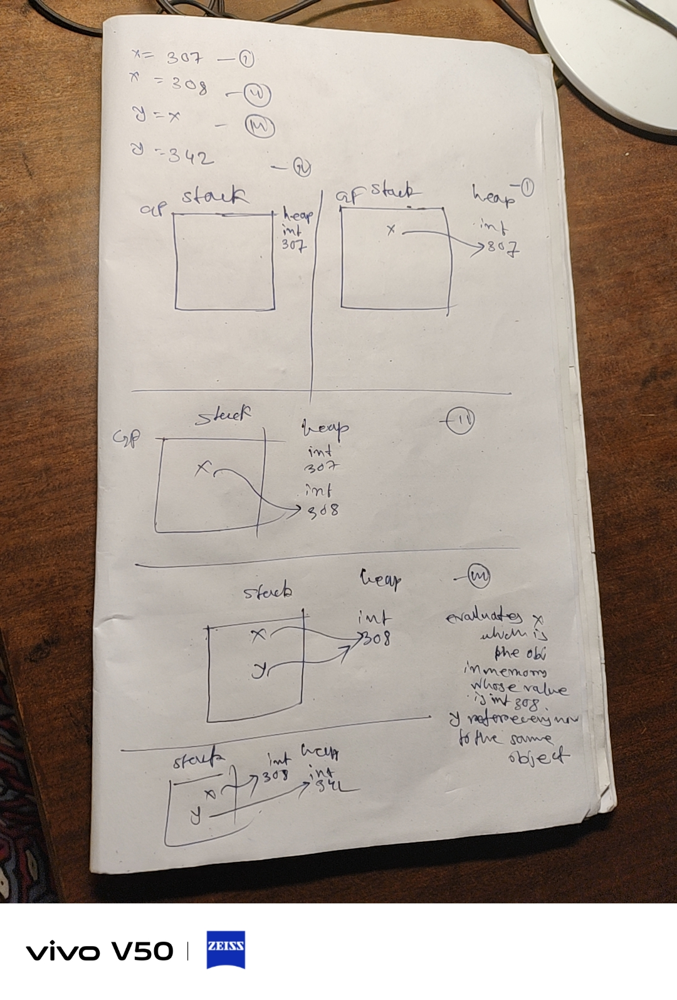

```
x = 307
x = 308
y = x
y = 342
```

int object will bre created 307 then it be referenced to x 
x indicates the int 308 and in 3rd line first rhs will be evaluated then it will be just the vlue int 308 then it will be associated with y so x and y techincally should refer the same object

the 4th line mean nothing will be deeleted as part of garbelcollenection process of python but it will lost its reference right and binded to y

## Environment model

<p align="center">
    
</p>